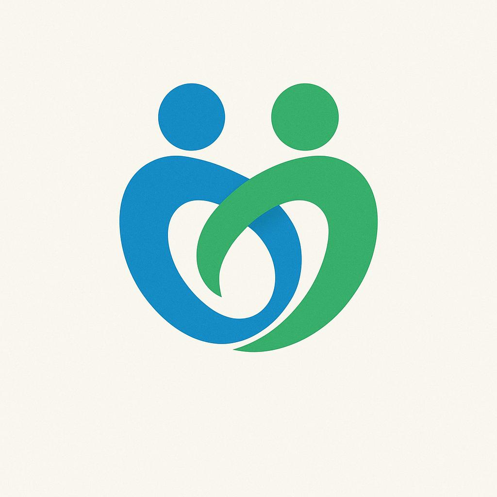

# SomosTetra

### Sua voz importa. Sua participação faz a diferença.

**Plataforma comunitária onde pessoas com tetraplegia constroem uma comunidade forte, votam em causas importantes e conquistam reconhecimento por seu engajamento.**

[🌐 Acesse a Plataforma](https://somostetra.org) • [💡 Veja Como Funciona](#-como-funciona) • [🤝 Participe](#-participe)

---

## 💡 Por Que Existimos

Pessoas com tetraplegia enfrentam desafios únicos e precisam de uma **voz coletiva forte** para influenciar políticas públicas, compartilhar experiências e construir uma rede de apoio.

**SomosTetra** é essa voz. Uma plataforma 100% gratuita, sem fins lucrativos e transparente, onde você pode:

- 🗳️ **Votar** em causas que realmente importam para a comunidade
- 🤝 **Conectar-se** com outras pessoas que entendem seus desafios
- 🏆 **Ser reconhecido** por suas contribuições e engajamento
- 📊 **Influenciar** decisões sobre saúde, acessibilidade, educação e direitos

### 🌐 Acesse Agora

👉 **[somostetra.org](https://somostetra.org)**

## 🚀 Como Funciona

### 1️⃣ **Cadastre-se Gratuitamente**
Crie sua conta em segundos. É 100% gratuito e você já ganha seus primeiros pontos!

### 2️⃣ **Participe das Votações**
Vote em causas sobre **saúde, acessibilidade, educação, direitos** e muito mais. Cada voto conta e fortalece a voz da comunidade.

### 3️⃣ **Convide Outras Pessoas**
Compartilhe seu link de convite e ajude a comunidade a crescer. Quanto mais pessoas, mais forte nossa voz!

### 4️⃣ **Conquiste Badges e Reconhecimento**
Quanto mais você participa, mais você evolui:

| Badge | Nome | Como Conquistar |
|-------|------|-----------------|
| 🎯 | **Primeiro Passo** | Completou o cadastro (1 ponto) |
| ⭐ | **Engajado** | Alcançou 50 pontos de participação |
| 🌟 | **Influenciador** | Indicou 5 pessoas (100 pontos) |
| 🗳️ | **Ativista** | Votou em 10 pautas (150 pontos) |
| 👑 | **Líder Comunitário** | Alcançou 500 pontos e liderança ativa |

### 5️⃣ **Acompanhe Seu Impacto**
Veja suas estatísticas, badges conquistadas e posição no ranking. Sua participação é visível e valorizada!

---

## 🎯 Como Você Ganha Pontos

- ✅ **+10 pontos** - Cadastro inicial
- 🗳️ **+5 pontos** - Cada voto em causas importantes
- 👥 **+20 pontos** - Cada membro (pessoa com tetraplegia) que você convidar
- 🤝 **+10 pontos** - Cada apoiador que você trouxer para a causa

**Quanto mais você participa, mais sua voz é amplificada!**

## 🛡️ Segurança e Privacidade

**Seus dados são seus.** Nós levamos privacidade a sério:

- 🔒 **Sem venda de dados** - Nunca venderemos suas informações
- 🚫 **Zero anúncios** - Plataforma 100% livre de publicidade
- 👁️ **Transparente** - Código aberto e auditável por qualquer pessoa
- 🔐 **Seguro** - Proteção de dados em todas as camadas
- 📋 **Política clara** - Leia nossa [política de privacidade](https://somostetra.org/privacidade)

**Sua privacidade não é negociável.**

---

## 📊 O Poder da Comunidade Unida

### Por Que Números Importam

Quando somos muitos, nossa voz **não pode ser ignorada**:

- 📈 **100 pessoas**: Começo de uma comunidade
- 🎯 **1.000 pessoas**: Força para dialogar com autoridades
- 🚀 **10.000 pessoas**: Poder real de influência em políticas públicas
- 💪 **100.000+ pessoas**: Voz impossível de ser ignorada

**Quanto maior a comunidade, maior o impacto de cada votação.**

### 🏆 Gamificação e Engajamento

Participar é **divertido e gratificante**:

- 🎮 **Sistema de Pontos** - Cada ação conta e é recompensada
- 🏅 **5 Níveis de Badges** - Mostre seu compromisso com a causa
- 📊 **[Ranking da Comunidade](https://somostetra.org/leaderboard)** - Veja os membros mais engajados
- 📈 **Dashboard Personalizado** - Acompanhe seu crescimento e impacto
- 🎯 **Metas e Conquistas** - Desafios para manter você motivado

**Participação social nunca foi tão envolvente!**

### 🌐 Múltiplos Domínios, Uma Comunidade

Acesse a plataforma de qualquer lugar:

- **[somostetra.org](https://somostetra.org)** ⭐ Principal
- **[soutetra.org](https://soutetra.org)** 🔄 Redireciona automaticamente
- **[soutetra.com](https://soutetra.com)** 🔄 Redireciona automaticamente

*Todos os domínios levam você para o mesmo lugar: nossa comunidade unida.*

---

## 🤝 Como Você Pode Ajudar

### 👥 **Como Membro da Comunidade**

1. **[Cadastre-se](https://somostetra.org)** e faça parte da comunidade
2. **Vote** nas causas que importam para você
3. **Convide amigos** e ajude a comunidade a crescer
4. **Compartilhe** nas redes sociais

### 💻 **Como Desenvolvedor**

Quer melhorar a plataforma? Adoramos contribuições!

- 🐛 **[Reporte bugs](https://github.com/fcavalcantirj/somostetra.org/issues)** - Encontrou algo errado?
- 💡 **[Sugira melhorias](https://github.com/fcavalcantirj/somostetra.org/issues)** - Tem ideias?
- 🔧 **[Contribua com código](https://github.com/fcavalcantirj/somostetra.org)** - Fork e envie um PR!

**Tecnologias**: Next.js 15, React 19, TypeScript, Supabase, Tailwind CSS v4

### 🎨 **Como Designer/UX**

- Sugira melhorias de interface
- Ajude a tornar a plataforma mais acessível
- Crie materiais visuais para redes sociais

### 📢 **Como Apoiador**

- Compartilhe a plataforma nas redes sociais
- Fale sobre SomosTetra com amigos e familiares
- Ajude a amplificar as causas da comunidade

---

## 🌟 100% Transparente e Open Source

### Por Que Open Source?

**Transparência total.** Todo o código desta plataforma está aberto para qualquer pessoa ver, revisar e auditar:

- 👁️ **Você pode ver exatamente como seus dados são tratados**
- 🔍 **Qualquer pessoa pode auditar a segurança**
- 🤝 **Desenvolvedores podem contribuir e melhorar**
- 💡 **Outras comunidades podem usar e adaptar**

👉 **[Ver código no GitHub](https://github.com/fcavalcantirj/somostetra.org)**

### ONG Sem Fins Lucrativos

**Nossa promessa:** SomosTetra **NUNCA** terá:
- ❌ Anúncios
- ❌ Venda de dados
- ❌ Mensalidades ou taxas
- ❌ Interesses comerciais

**✅ 100% gratuito. 100% da comunidade. Para sempre.**

---

## 📞 Fale Conosco

- 📧 **E-mail**: fcavalcanti@somostetra.org.br
- 💻 **GitHub**: [@fcavalcantirj](https://github.com/fcavalcantirj)
- 📱 **Instagram**: [@sou.tetra](https://instagram.com/sou.tetra)
- 💼 **LinkedIn**: [SomosTetra](https://linkedin.com/company/sou-tetra)

---

## 🚀 Pronto Para Fazer a Diferença?

**Sua voz importa. Junte-se a nós.**

### [🌐 Acesse a Plataforma Agora](https://somostetra.org)

---

**Feito com ❤️ pela e para a comunidade**

[⭐ Star no GitHub](https://github.com/fcavalcantirj/somostetra.org) • [🐛 Reportar Bug](https://github.com/fcavalcantirj/somostetra.org/issues) • [💡 Sugerir Melhoria](https://github.com/fcavalcantirj/somostetra.org/issues) • [📊 Ver Ranking](https://somostetra.org/leaderboard)

---

